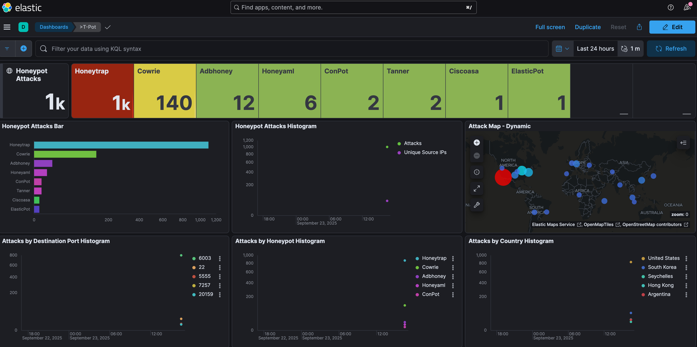
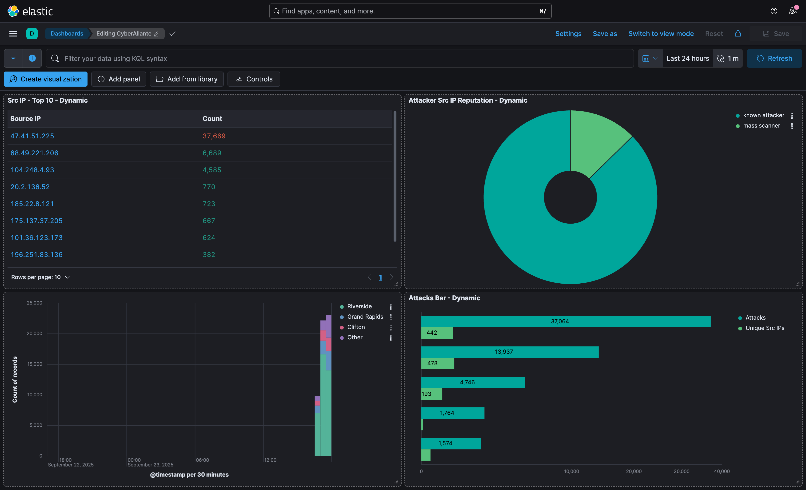

# 🛡️ T-Pot Honeypot Deployment on DigitalOcean | CyberAllante

This project is part of my cybersecurity portfolio and showcases my deployment of **T-Pot**, an all-in-one honeypot platform, on a VPS hosted by DigitalOcean.  

I built this environment to **capture and analyze real-world cyberattacks** against exposed services in the wild.  
By collecting and visualizing attack data in Kibana and Elastic dashboards, I was able to see how adversaries target systems, what services they go after, and which credentials they attempt to brute-force.  

Through this project, I was able to strengthen my hands-on skills in:
- Deploying and configuring honeypot systems in the cloud
- Using Elastic Stack for security monitoring and data visualization
- Analyzing attacker behavior and generating threat intelligence

---

## 🚀 Project Overview
- **Platform:** DigitalOcean VPS (Ubuntu 22.04)
- **Honeypot Framework:** T-Pot 24.04.1
- **Monitoring & Analysis:** Kibana (Elastic stack), Attack Maps, CyberChef, SpiderFoot
- **Objective:** Gain hands-on experience with honeypots, threat data collection, and visualization.

---

## ⚙️ Deployment Steps
1. Provisioned a VPS on DigitalOcean (2 CPU / 4 GB RAM).
2. Downloaded the latest **T-Pot ISO** and performed installation via SSH.
3. Allowed required firewall ports for T-Pot services.
4. Verified containerized honeypots (Cowrie, Honeytrap, ConPot, etc.) were running.
5. Connected to the Kibana dashboards for real-time monitoring.

---

## 📊 Results & Dashboards

### Honeypot Attack Statistics

- Over **1,000 attacks** captured in 24 hours.
- Most attacks targeted **Honeytrap** and **Cowrie** honeypots.
- Attack sources included **United States, South Korea, Argentina, Hong Kong, Singapore**.

---

## 📊 Custom Kibana Dashboard – Attack Insights

I built a **custom Kibana dashboard** on top of T-Pot’s data to highlight real-time attack trends.  
**Panels included:**
- **Top Source IPs** – repeated offenders by event count
- **Attacker IP Reputation** – known attacker vs mass scanner
- **Attacks Over Time** – spikes and volume by 30-min buckets
- **Attacks by City / Country / Port** – who’s hitting, from where, and what they target

**Why this matters:** turns raw honeypot logs into **actionable threat intelligence** and shows my ability to design Elastic visualizations that answer security questions quickly.

<strong>How I built it (quick steps)</strong>

1) **Data view:** selected my T-Pot/Logstash index (e.g., `logstash-*`).  
2) **Lens Visualizations:**
   - Bar/Table: **Top values of** `source.ip` (size 10) → metric: **Count**
   - Donut: **Terms** on `attacker.reputation` (or your equivalent field)
   - Line: X-axis `@timestamp` (auto interval), Y-axis **Count**
   - Bar/Pie: **Terms** on `geoip.city_name.keyword` and/or `geoip.country_name.keyword`
   - Bar: **Terms** on `destination.port`
3) **Dashboard:** added each panel → saved as **“Attack Insights (Custom)”**.

### Attack Map
  

- Live visualization of incoming connections worldwide.
- Largest clusters from **North America** and **Asia**.

---

### Service Distribution

- Attackers attempted **FTP, SSH, Telnet, SQL, and DNS** services.
- Common brute-force attempts against SSH (`root`, `admin` users).

---

### Threat Intelligence & Suricata Alerts

- Top attacker networks included **Charter, UCloud, DigitalOcean, and Microsoft**.  
- Frequent attacker IPs were observed repeatedly attempting malicious traffic.  
- Suricata alerts flagged issues such as **invalid timestamps, spurious retransmissions, truncated packets, and suspicious SSH activity**.

---

## 🧠 Key Takeaways
- T-Pot provides an **excellent all-in-one honeypot lab** for learning threat intelligence.
- Attack traffic was captured within **minutes** of deployment, showing the scale of opportunistic scans on the internet.
- Visualization tools like Kibana and the Attack Map make analysis much more accessible.
- This project reinforced concepts in **incident response, intrusion detection, and adversary behavior analysis**.

---

## 🔮 Next Steps
- Expand honeypot monitoring with **custom dashboards**.
- Export captured data for further analysis in **Splunk** or **ELK**.
- Integrate with **SIEM/SOAR pipelines** for automation.

---

## 📂 Repository Contents
- `/screenshots` – Captured images of dashboards and results.
- `README.md` – Project write-up and documentation.

---

## 📜 Credits
- [T-Pot Community Edition](https://github.com/telekom-security/tpotce) by Deutsche Telekom Security.
